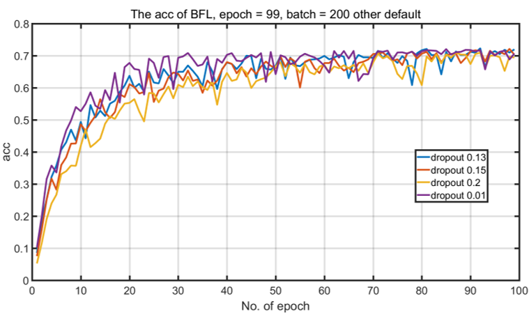

# EEE_412_prez
eee412_prez
# Building-floor certification and location estimation by Wi-Fi using deep learning method

##Introduction
``The indoor environment is hard to receive the signal from GPS. 
``Wi-Fi signal is easy to be received at indoor environment. The design of this project is processing the received signal strength (RSS) from nearby access points (APs) and judging the location.
``It is hard to record RSSs from APs of the entire area in all situations or coding functions to solve the complex processing. 
``Deep learning method using deep neural networks can provide a solution and reduce a lot of human tuning and repeat works. The method can auto encode and judge if the model is good or not for a certain environment by the deep neural networks.
##Methodology
``Using tensorflow based on python to build deep neural networks. The DNNs learn from a training datasets, after the training, the model will provide an result by processing the RSS from the APs .
``RSSs from nearby APs are submitted by a user or an App running background in the user’s mobile device to the system as part of a service request. The submitted RSS measurements will be compared with the RSS samples of known location is returned as the user’s estimated location-aware services by integrating existing data and services available.
##Default setting
\#+STARTUP: showall

* System parameters
  - Numpy random number seed: 0
  - Ratio of training data to overall data: 0.70
  - Ratio of validation data to overall data: 0.20
  - Ratio of test data to overall data: 0.10
  - Number of epochs: 200
  - Batch size: 200
 - SAE hidden layers: 256-128-64-128-256
  - SAE activation: tanh
  - SAE bias: False
  - SAE optimizer: adam
  - SAE loss: mse
  - Classifier hidden layers: 128-256-512
  - Classifier hidden layer activation: elu
     - Classifier bias: False
  - Classifier optimizer: adagrad
  - Classifier loss: categorical_crossentropy
  - Classifier dropout rate: 0.2

## Acc result of epochs by different dropout
The left figure shows the accuracy result of different dropout 0.13, 0.15, 0.2, 0.01. When the epoch is lower the 40th, the lower dropout has a better performance. But the result is tending to resemble as shown in figure.
The accuracy is tend to around 70% when epoch goes to 99.
:
##Different dropout (zoomed in)
As the right side of the previous figure is messed. We zoomed in this figure. The overall accuracy of the lower dropout act well before 85 epoch but dropout 0.13 performance better.

:
##The training process and the test accuracy
The overall accuracy (blue) close to the maximum of the accuracy of each epoch. This shows that the model is successful in generate the model to achieve a good performance in judging the previous models of each epoch.

:
##The acc in different CLASSIFIER_ACTIVATION
:
##The best result (but uncommon sense)
:
##Next step – prove or abandon the model
* ``A random-location set of data need to be processed by the picked model to show if the model can provide the correct building/floor/location information to the users.
   - ``If the location information is correctly provided to users, it means that the model is likely successful. We still need to collect data from users to make further research.
   - ``If the location information is not correctly provided to users, the model is likely failed. We need to debug step-by step to find out where is the error occurred and fix it.

##Next step – further research
``Deep learning performs unsatisfactory when solving a problem which the relationship of the data and result is variable. 
``The received Wi-Fi signal could be effected by many reasons such as temperature, weather, unstable power supply and etc.
``The deep learning structure could be optimized by considering the factors above.
